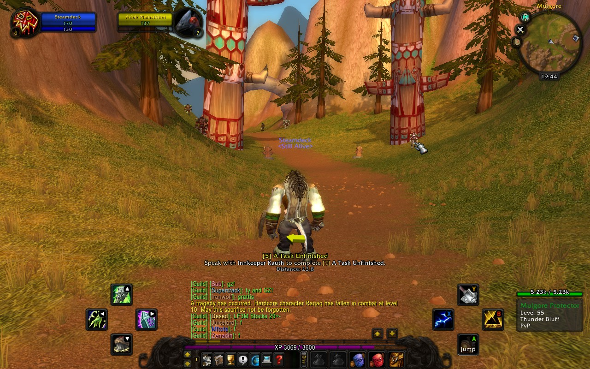
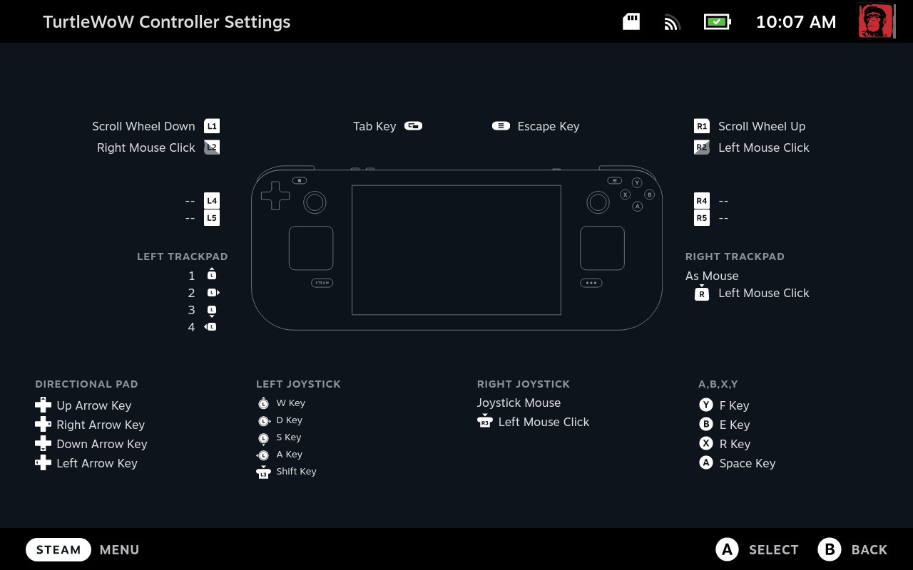
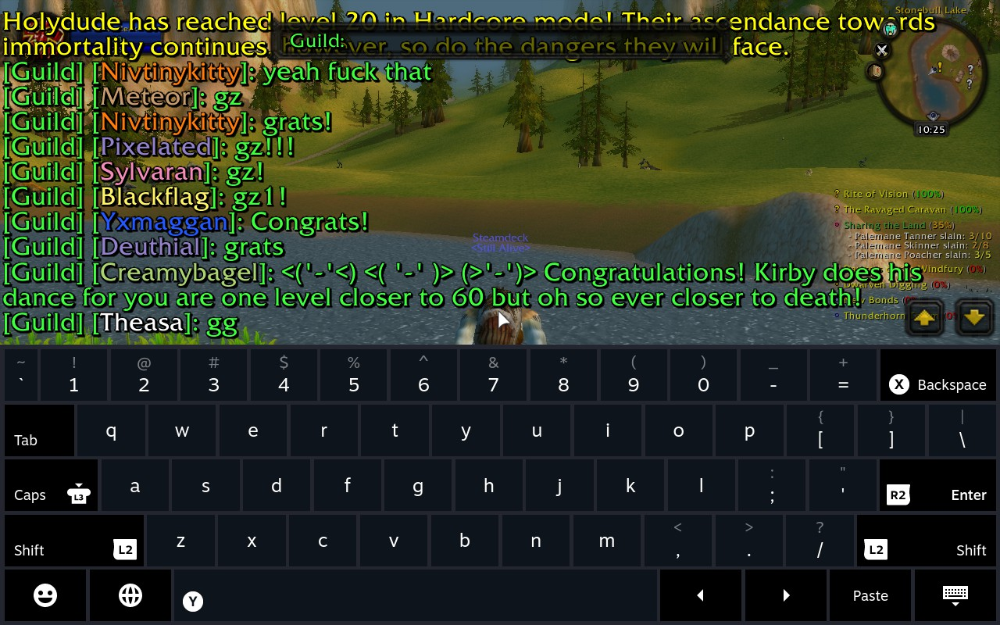
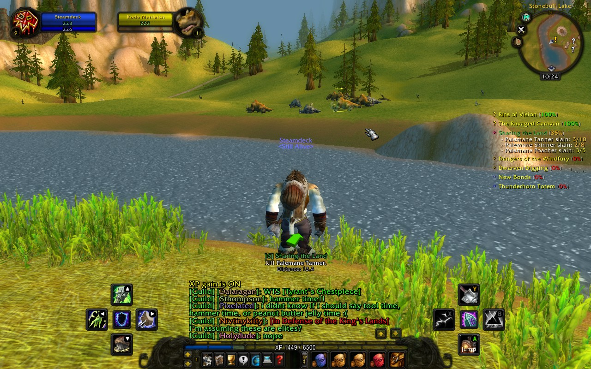

# ShaguController

A World of Warcraft (1.12) addon that enhances the default user interface to be more controller friendly. This addon is made with the [SteamDeck](https://www.steamdeck.com/en/) in mind. If you don't use a SteamDeck you need to use another software to map controller buttons to keyboard buttons.

> WARNING: This addon changes in-game keybinds to align with the SteamDeck's 'Keyboard (WASD) and Mouse' layout. If you run this addon on your PC, you might need to restore your old keybinds manually after.

*(Addons used: ShaguController, ShaguTweaks, ShaguPlates, pfQuest)*

## Installation (Vanilla, 1.12)
1. Download **[Latest Version](https://github.com/shagu/ShaguController/archive/master.zip)**
2. Unpack the Zip file
3. Rename the folder "ShaguController-master" to "ShaguController"
4. Copy "ShaguController" into Wow-Directory\Interface\AddOns
5. Restart Wow

## Keybinding

The addon sets in-game keybinds based on the button mappings provided by SteamDeck's "Keyboard (WASD) and Mouse"-Layout:

* The A button is bound to jump
* The Y, B and X buttons are bound to the 3 action buttons on the right side
* The D-Pad is bound to the 4 action buttons on the left side
* The L1 and R1 buttons are used for next-target and previous-target selection
* The "Tab Key" opens the world map
* The "Left Trackpad" is bound to:
  - Up: Toggle bags and inventory
  - Right: Toggle quest log
  - Down: Toggle friend list
  - Left: Toggle spell book

## UI Changes

* The action bar size is reduced and got all action buttons removed, to have only the
bag buttons and the micro panel left.
* The normal action buttons are moved to the left and the right side
to match the gamepad layout.
* Action buttons got their keybinds replaced by gamepad button icons.
* Out-of-Range actions will be displayed as a gray-scaled texture.
* The loot window is automatically positioned to have the most relevant part of it under your cursor.
* The chat window is attached to the main actionbar and got buttons removed.
* Clicking on the chat window will zoom and move it to make space for the onscreen keyboard.

*Chat is moved, to make space for screen keyboard*

*Buttons shade to grayscale if out of range*

# Play on SteamDeck

> Prerequisite: You already have the game copied over to the steamdeck.

Enter the Desktop Mode, navigate to your World of Warcraft directory and install the add-on as usual:

    cd Interface/AddOns
    git clone https://github.com/shagu/ShaguController
    cd -

Now copy the `AutoLogin.exe` from the addon directory to the root folder of your game:

    cp Interface/AddOns/ShaguController/autologin/AutoLogin.exe .

Open Steam Library and click on "[+] Add a Game" and select "Add a Non-Steam Game...".
Browse to your World of Warcraft Folder and select AutoLogin.exe. Then choose "Add Selected Programs".
Find the "AutoLogin.exe" in your Steam Library and right click -> Properties.
* Set the name to: World of Warcraft
* Set the launch options: `Wow.exe account password 1000 --proton`  
  - account: your account name
  - password: your account password
  - 1000: the delay it waits before entering your credentials

You can now launch the game from within the SteamDeck UI and it will automatically log you in.
